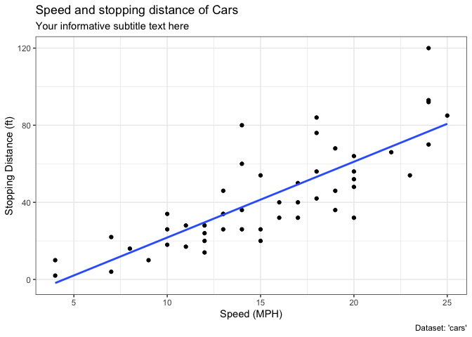
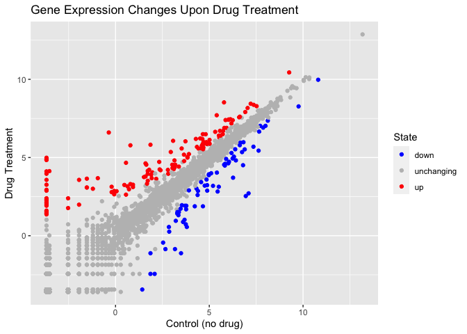
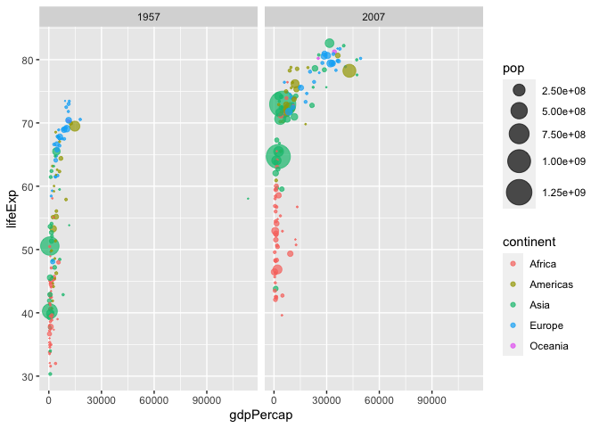
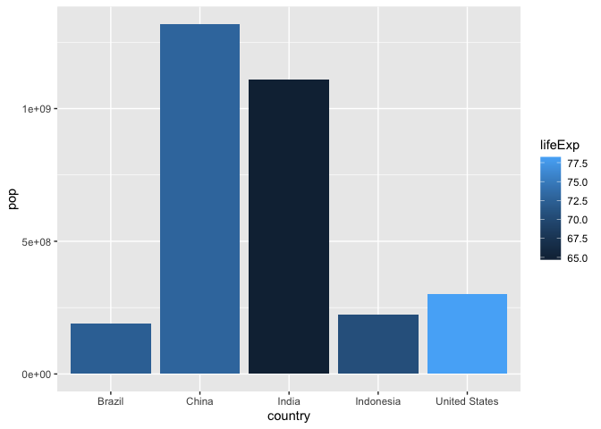

# Class 5 data Visualization with ggplot2
Chelsea (PID: A16871799)

## Using GGPLOT

The ggplot2 package needs to be installed as it does not come with R ”
out of the box”

We use the ‘install.packages()’ to do this

``` r
head(cars)
```

      speed dist
    1     4    2
    2     4   10
    3     7    4
    4     7   22
    5     8   16
    6     9   10

To use ggplot we first need to load it up before I can call any of
functions in the packages. do this with the `library()` function.

``` r
library(ggplot2)
ggplot()
```


All ggplot find at least 3 thing -data (stuff we plot) -aesthetic
mapping (aes value) -geoms

``` r
ggplot(cars)+ 
  aes(x=speed, y=dist)+
  geom_point()+
  geom_smooth(method="lm", se=FALSE)+
  labs(title="Speed and stopping distance of Cars",
       x="Speed (MPH)", 
       y="Stopping Distance (ft)",
       subtitle = "Your informative subtitle text here",
       caption="Dataset: 'cars'")+
       theme_bw()
```

    `geom_smooth()` using formula = 'y ~ x'



ggplot is not the onlygraphing system in R there are more. There is even
“base R” graphics.

``` r
plot(cars)
```


``` r
url <- "https://bioboot.github.io/bimm143_S20/class-material/up_down_expression.txt"
genes <- read.delim(url)
head(genes)
```

            Gene Condition1 Condition2      State
    1      A4GNT -3.6808610 -3.4401355 unchanging
    2       AAAS  4.5479580  4.3864126 unchanging
    3      AASDH  3.7190695  3.4787276 unchanging
    4       AATF  5.0784720  5.0151916 unchanging
    5       AATK  0.4711421  0.5598642 unchanging
    6 AB015752.4 -3.6808610 -3.5921390 unchanging

``` r
nrow(genes)
```

    [1] 5196

``` r
ncol(genes)
```

    [1] 4

``` r
sum(genes$State=="up")
```

    [1] 127

``` r
table(genes$State)
```


          down unchanging         up 
            72       4997        127 

``` r
round( table(genes$State)/nrow(genes) * 100, 2 )
```


          down unchanging         up 
          1.39      96.17       2.44 

``` r
p <- ggplot(genes)+
  aes(x=Condition1, y=Condition2, col=State)+
  geom_point()
  
p+scale_colour_manual(values=c("blue","gray","red"))+
  labs(title="Gene Expression Changes Upon Drug Treatment",
       x="Control (no drug)", 
       y="Drug Treatment")
```



# File location online

``` r
library("dplyr")
```


    Attaching package: 'dplyr'

    The following objects are masked from 'package:stats':

        filter, lag

    The following objects are masked from 'package:base':

        intersect, setdiff, setequal, union

``` r
url <- "https://raw.githubusercontent.com/jennybc/gapminder/master/inst/extdata/gapminder.tsv"
gapminder <- read.delim(url)
gapminder_2007 <- gapminder %>% filter(year==2007)
```

``` r
gapminder_1957 <- gapminder %>% filter(year==1957| year==2007)

ggplot(gapminder_1957) + 
  geom_point(aes(x = gdpPercap, y = lifeExp, color=continent,
                 size = pop), alpha=0.7) + 
  scale_size_area(max_size = 10) +
  facet_wrap(~year)
```



``` r
gapminder_top5 <- gapminder %>% 
  filter(year==2007) %>% 
  arrange(desc(pop)) %>% 
  top_n(5, pop)

gapminder_top5
```

            country continent year lifeExp        pop gdpPercap
    1         China      Asia 2007  72.961 1318683096  4959.115
    2         India      Asia 2007  64.698 1110396331  2452.210
    3 United States  Americas 2007  78.242  301139947 42951.653
    4     Indonesia      Asia 2007  70.650  223547000  3540.652
    5        Brazil  Americas 2007  72.390  190010647  9065.801

``` r
ggplot(gapminder_top5) + 
  geom_col(aes(x = country, y = pop, fill = lifeExp))
```



``` r
ggplot(gapminder_top5) +
  aes(x=reorder(country, -pop), y=pop, fill=country) +
  geom_col(col="gray30") +
  guides(fill="none")
```


