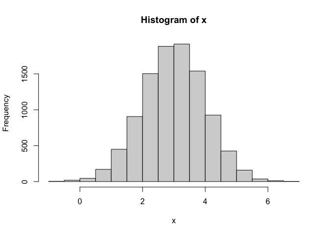

# Class07: Machine Learning 1
Chelsea (PID:A16871799)

clustering

We will start today’s lab with clustering methods, in particular
so-called K-means. The main function for this in R is `kmeans()`

Let’s try it on some made up data where we know data should be

``` r
x <- rnorm(10000,mean=3)
hist(x)
```



60 points

``` r
tmp <- c(rnorm(30, mean=3),rnorm(30,mean=-3))
x <- cbind(x=tmp,y=rev(tmp))
head(x)
```

                 x         y
    [1,] 2.9925923 -3.504870
    [2,] 2.9937431 -3.035774
    [3,] 3.4386295 -3.711276
    [4,] 3.9900331 -3.577082
    [5,] 3.6502451 -1.833210
    [6,] 0.8816067 -3.015545

we can pass this to the base R function`plot(x)`

``` r
plot(x)
```


``` r
k <- kmeans(x,centers=2,nstart=20)
k
```

    K-means clustering with 2 clusters of sizes 30, 30

    Cluster means:
              x         y
    1  2.844161 -3.170370
    2 -3.170370  2.844161

    Clustering vector:
     [1] 1 1 1 1 1 1 1 1 1 1 1 1 1 1 1 1 1 1 1 1 1 1 1 1 1 1 1 1 1 1 2 2 2 2 2 2 2 2
    [39] 2 2 2 2 2 2 2 2 2 2 2 2 2 2 2 2 2 2 2 2 2 2

    Within cluster sum of squares by cluster:
    [1] 51.33286 51.33286
     (between_SS / total_SS =  91.4 %)

    Available components:

    [1] "cluster"      "centers"      "totss"        "withinss"     "tot.withinss"
    [6] "betweenss"    "size"         "iter"         "ifault"      

> Q1: How many points are in each cluster?

``` r
k$size
```

    [1] 30 30

> Q2 Cluster membership

``` r
k$cluster
```

     [1] 1 1 1 1 1 1 1 1 1 1 1 1 1 1 1 1 1 1 1 1 1 1 1 1 1 1 1 1 1 1 2 2 2 2 2 2 2 2
    [39] 2 2 2 2 2 2 2 2 2 2 2 2 2 2 2 2 2 2 2 2 2 2

> Q3: Cluster center

``` r
k$centers
```

              x         y
    1  2.844161 -3.170370
    2 -3.170370  2.844161

``` r
plot(x,col=k$cluster)
```


> Q4 plot my results

``` r
plot(x,col=k$cluster,pch=16)
```


> Q5. Cluster the data again with kmeans()into 4 groups and plot the
> results

``` r
k4 <- kmeans(x,centers=4,nstart=20)
plot(x,col=k4$cluster,pch=16)
```


k-means is popular mostly because it’s fast and relatively
straightforward to run and understand. It has a big limitation in that
you need to tell it how many groups(k, or centers) you want.

\#hierarchical clustering

The main function in base R is called `hclust()`. You have to pass it in
a “distance matrix” not just your input data.

``` r
hc <- hclust( dist(x) )
hc
```


    Call:
    hclust(d = dist(x))

    Cluster method   : complete 
    Distance         : euclidean 
    Number of objects: 60 

``` r
plot(hc)
```


To find the cluster (cluster membership vector) from a `hclust()` result
we “cut” the tree we like.

``` r
plot(hc)
abline(h=8,col="red")
```


``` r
grps <- cutree(hc, h=8)
```

``` r
table(grps)
```

    grps
     1  2 
    30 30 

``` r
plot(x,col=grps,pch=16)
```


\#principlal component

\##PCA of UK food data

``` r
url <- "https://tinyurl.com/UK-foods"
x <- read.csv(url)
x
```

                         X England Wales Scotland N.Ireland
    1               Cheese     105   103      103        66
    2        Carcass_meat      245   227      242       267
    3          Other_meat      685   803      750       586
    4                 Fish     147   160      122        93
    5       Fats_and_oils      193   235      184       209
    6               Sugars     156   175      147       139
    7      Fresh_potatoes      720   874      566      1033
    8           Fresh_Veg      253   265      171       143
    9           Other_Veg      488   570      418       355
    10 Processed_potatoes      198   203      220       187
    11      Processed_Veg      360   365      337       334
    12        Fresh_fruit     1102  1137      957       674
    13            Cereals     1472  1582     1462      1494
    14           Beverages      57    73       53        47
    15        Soft_drinks     1374  1256     1572      1506
    16   Alcoholic_drinks      375   475      458       135
    17      Confectionery       54    64       62        41

\#Q1. How many rows and columns are in your new data frame named x? What
R functions could you use to answer this questions? R functions such as
dim(x); ncol(x) and nrow(x).

``` r
dim(x)
```

    [1] 17  5

``` r
x
```

                         X England Wales Scotland N.Ireland
    1               Cheese     105   103      103        66
    2        Carcass_meat      245   227      242       267
    3          Other_meat      685   803      750       586
    4                 Fish     147   160      122        93
    5       Fats_and_oils      193   235      184       209
    6               Sugars     156   175      147       139
    7      Fresh_potatoes      720   874      566      1033
    8           Fresh_Veg      253   265      171       143
    9           Other_Veg      488   570      418       355
    10 Processed_potatoes      198   203      220       187
    11      Processed_Veg      360   365      337       334
    12        Fresh_fruit     1102  1137      957       674
    13            Cereals     1472  1582     1462      1494
    14           Beverages      57    73       53        47
    15        Soft_drinks     1374  1256     1572      1506
    16   Alcoholic_drinks      375   475      458       135
    17      Confectionery       54    64       62        41

I need to fix that first columns

``` r
# Note how the minus indexing works
rownames(x) <- x[,1]
x <- x[,-1]
head(x)
```

                   England Wales Scotland N.Ireland
    Cheese             105   103      103        66
    Carcass_meat       245   227      242       267
    Other_meat         685   803      750       586
    Fish               147   160      122        93
    Fats_and_oils      193   235      184       209
    Sugars             156   175      147       139

``` r
x <- read.csv(url, row.names=1)
head(x)
```

                   England Wales Scotland N.Ireland
    Cheese             105   103      103        66
    Carcass_meat       245   227      242       267
    Other_meat         685   803      750       586
    Fish               147   160      122        93
    Fats_and_oils      193   235      184       209
    Sugars             156   175      147       139

Q2: prefer the second method that set row.names=1 because if run the
first approach code block (i.e. the one with x \<- x\[,-1\])multiple
times,columns decreases one by one

``` r
barplot(as.matrix(x), beside=T, col=rainbow(nrow(x)))
```


Q3: Changing what optional argument in the above barplot() function
results in the following plot? \#beside=FALSE

``` r
barplot(as.matrix(x), beside=F, col=rainbow(nrow(x)))
```


``` r
pairs(x, col=rainbow(17), pch=16)
```


Q5:The R code generates a matrix of pairwise scatter plots for the
dataset x, and it uses 17 different colors to represent different
categories of data points. If a given point lies on the diagonal for a
given plot, the point is having equal distance with regards to the 2
country, so they eat same food between 2 country

\##Principal Component

PCA can help us make sense of these types of dataset. Let’s see how it
works.

The main function in “base” R is called `prcomp()`.In this case we want
to first take the transpose of our input `x` so the columns are the food
types and the countries are the rows.

``` r
head(t(x))
```

              Cheese Carcass_meat  Other_meat  Fish Fats_and_oils  Sugars
    England      105           245         685  147            193    156
    Wales        103           227         803  160            235    175
    Scotland     103           242         750  122            184    147
    N.Ireland     66           267         586   93            209    139
              Fresh_potatoes  Fresh_Veg  Other_Veg  Processed_potatoes 
    England               720        253        488                 198
    Wales                 874        265        570                 203
    Scotland              566        171        418                 220
    N.Ireland            1033        143        355                 187
              Processed_Veg  Fresh_fruit  Cereals  Beverages Soft_drinks 
    England              360         1102     1472        57         1374
    Wales                365         1137     1582        73         1256
    Scotland             337          957     1462        53         1572
    N.Ireland            334          674     1494        47         1506
              Alcoholic_drinks  Confectionery 
    England                 375             54
    Wales                   475             64
    Scotland                458             62
    N.Ireland               135             41

``` r
pca <- prcomp(t(x))
summary(pca)
```

    Importance of components:
                                PC1      PC2      PC3       PC4
    Standard deviation     324.1502 212.7478 73.87622 2.921e-14
    Proportion of Variance   0.6744   0.2905  0.03503 0.000e+00
    Cumulative Proportion    0.6744   0.9650  1.00000 1.000e+00

``` r
plot(pca$x[,1], pca$x[,2], xlab="PC1", ylab="PC2", xlim=c(-270,500))
text(pca$x[,1], pca$x[,2],colnames(x),
     col=c("orange","red","blue","darkgreen"))
```


the “loadings” tell us how much the origonal variable in our case the
foods contribute to the new variable. such as the PCs

``` r
head(pca$rotation)
```

                            PC1         PC2         PC3         PC4
    Cheese         -0.056955380  0.01601285  0.02394295 -0.40938259
    Carcass_meat    0.047927628  0.01391582  0.06367111  0.72948192
    Other_meat     -0.258916658 -0.01533114 -0.55384854  0.33100113
    Fish           -0.084414983 -0.05075495  0.03906481  0.02237588
    Fats_and_oils  -0.005193623 -0.09538866 -0.12522257  0.03451216
    Sugars         -0.037620983 -0.04302170 -0.03605745  0.02494334

``` r
## Lets focus on PC1 as it accounts for > 90% of variance 
par(mar=c(10, 3, 0.35, 0))
barplot( pca$rotation[,1], las=2)
```


Q6. What is the main differences between N. Ireland and the other
countries of the UK in terms of this data-set? The main difference is in
the food consumption of Fresh_fruit and alcoholic drinks

``` r
par(mar=c(10, 3, 0.35, 0))
barplot( pca$rotation[,2], las=2)
```


Q9: Generate a similar ‘loadings plot’ for PC2. What two food groups
feature prominantely and what does PC2 mainly tell us about?
Fresh_potatoes and soft_drinks are the 2 main features and PC2 mainly
tell us about what is the second most variation in the data.
