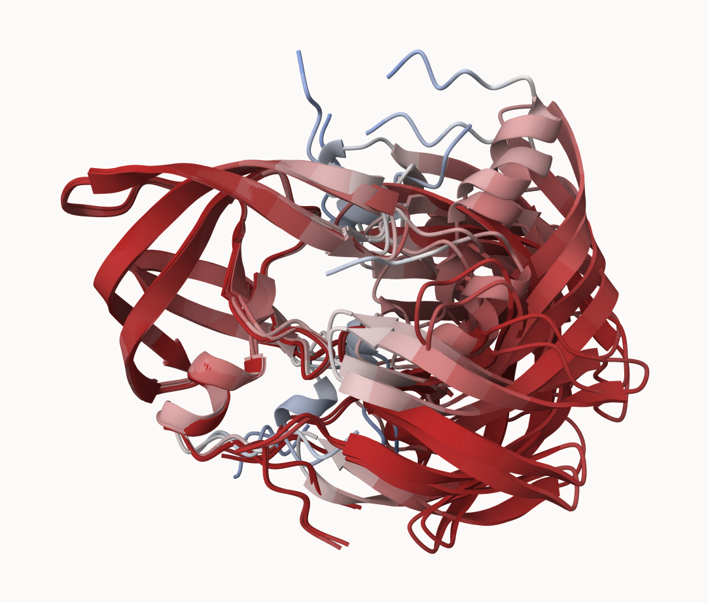
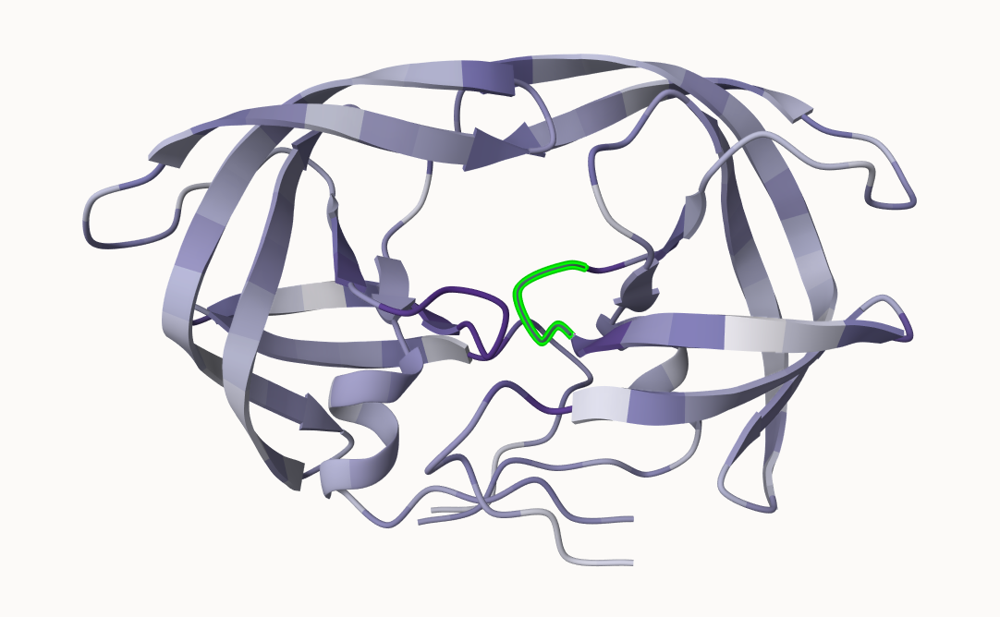

# Class 10: Comparative analysis of structures
Chelsea A16871799

\#PDB database Let’s first see what is in PDB database– the main
repository of protein structure

Download composition sats from: http://www.rcsb.org/stats/summary

For context: Unitprot Contain 251600,768. The PDB only contains 183,201

``` r
stats <- read.csv("Data Export Summary.csv",row.names=1)
stats
```

                              X.ray     EM    NMR Multiple.methods Neutron Other
    Protein (only)          158,844 11,759 12,296              197      73    32
    Protein/Oligosaccharide   9,260  2,054     34                8       1     0
    Protein/NA                8,307  3,667    284                7       0     0
    Nucleic acid (only)       2,730    113  1,467               13       3     1
    Other                       164      9     32                0       0     0
    Oligosaccharide (only)       11      0      6                1       0     4
                              Total
    Protein (only)          183,201
    Protein/Oligosaccharide  11,357
    Protein/NA               12,265
    Nucleic acid (only)       4,327
    Other                       205
    Oligosaccharide (only)       22

The R recognize 158,844 as character as it contains commas, we need to
fix this.

``` r
x <- stats$X.ray
x
```

    [1] "158,844" "9,260"   "8,307"   "2,730"   "164"     "11"     

``` r
as.numeric(gsub(",", "",x))
```

    [1] 158844   9260   8307   2730    164     11

``` r
rm.comma <- function(x){
  as.numeric(gsub(",","",x))
}
```

``` r
rm.comma(stats$EM)
```

    [1] 11759  2054  3667   113     9     0

\#I can use appoly() to fix the whole table

``` r
pdbstats <- apply(stats,2, rm.comma)
rownames(pdbstats) <- rownames(stats)
head(pdbstats)
```

                             X.ray    EM   NMR Multiple.methods Neutron Other
    Protein (only)          158844 11759 12296              197      73    32
    Protein/Oligosaccharide   9260  2054    34                8       1     0
    Protein/NA                8307  3667   284                7       0     0
    Nucleic acid (only)       2730   113  1467               13       3     1
    Other                      164     9    32                0       0     0
    Oligosaccharide (only)      11     0     6                1       0     4
                             Total
    Protein (only)          183201
    Protein/Oligosaccharide  11357
    Protein/NA               12265
    Nucleic acid (only)       4327
    Other                      205
    Oligosaccharide (only)      22

Q1: What percentage of structures in the PDB are solved by X-Ray and
Electron Microscopy.

``` r
totals <- apply(pdbstats,2, sum)
totals
```

               X.ray               EM              NMR Multiple.methods 
              179316            17602            14119              226 
             Neutron            Other            Total 
                  77               37           211377 

``` r
round(totals/totals["Total"]*100,2)
```

               X.ray               EM              NMR Multiple.methods 
               84.83             8.33             6.68             0.11 
             Neutron            Other            Total 
                0.04             0.02           100.00 

84.83% is X.ray while 8.33% is EM. Q2: What proportion of structures in
the PDB are protein?

``` r
round(pdbstats[1,"Total"]/sum(pdbstats[,"Total"])*100,2)
```

    [1] 86.67

\<Q3: Type HIV in the PDB website search box on the home page and
determine how many HIV-1 protease structures are in the current PDB?
SKIPPED Q4: Water molecules normally have 3 atoms. Why do we see just
one atom per water molecule in this structure? \#There is a 2 Angstrom
structure and hydrogen is not visible at all times. water molecules are
too tiny to visualize.

Q5: There is a critical “conserved” water molecule in the binding site.
Can you identify this water molecule? What residue number does this
water molecule have? \#The water molecule HOH 308 near Mk1

Q6: Here is a lovely figure of HIP-Pr with the catalytic residues, Mk1
compound and all important water 308.


Q7: \[Optional\] As you have hopefully observed HIV protease is a
homodimer (i.e. it is composed of two identical chains). With the aid of
the graphic display can you identify secondary structure elements that
are likely to only form in the dimer rather than the monomer?

The bio3d package for structural bioinformatics

``` r
library(bio3d)
pdb <- read.pdb("1hsg")
```

      Note: Accessing on-line PDB file

``` r
pdb
```


     Call:  read.pdb(file = "1hsg")

       Total Models#: 1
         Total Atoms#: 1686,  XYZs#: 5058  Chains#: 2  (values: A B)

         Protein Atoms#: 1514  (residues/Calpha atoms#: 198)
         Nucleic acid Atoms#: 0  (residues/phosphate atoms#: 0)

         Non-protein/nucleic Atoms#: 172  (residues: 128)
         Non-protein/nucleic resid values: [ HOH (127), MK1 (1) ]

       Protein sequence:
          PQITLWQRPLVTIKIGGQLKEALLDTGADDTVLEEMSLPGRWKPKMIGGIGGFIKVRQYD
          QILIEICGHKAIGTVLVGPTPVNIIGRNLLTQIGCTLNFPQITLWQRPLVTIKIGGQLKE
          ALLDTGADDTVLEEMSLPGRWKPKMIGGIGGFIKVRQYDQILIEICGHKAIGTVLVGPTP
          VNIIGRNLLTQIGCTLNF

    + attr: atom, xyz, seqres, helix, sheet,
            calpha, remark, call

\#predicting functional motions of a single structure

Let’s finish toady with a bioinformatics calculators predict the
functional motion of a PDB structure.

``` r
adk <- read.pdb("6s36")
```

      Note: Accessing on-line PDB file
       PDB has ALT records, taking A only, rm.alt=TRUE

``` r
m <- nma(adk)
```

     Building Hessian...        Done in 0.021 seconds.
     Diagonalizing Hessian...   Done in 0.449 seconds.

``` r
plot(m)
```


``` r
mktrj(m, file="adk_m7.pdb")
```

we need some packages for today class include `bio3d` and `msa`. The
`msa` package is from BioConductor. packages focus on genomics type work
are managed by the \`BiocManager packages.

Insatll `BiocManager` with install.packages(“BiocManager”) in the
console and then BiocManager::install(“msa”) all entered iin the R
“brain” console.

``` r
library(bio3d)
aa <- get.seq("1ake_A")
```

    Warning in get.seq("1ake_A"): Removing existing file: seqs.fasta

    Fetching... Please wait. Done.

``` r
aa
```

                 1        .         .         .         .         .         60 
    pdb|1AKE|A   MRIILLGAPGAGKGTQAQFIMEKYGIPQISTGDMLRAAVKSGSELGKQAKDIMDAGKLVT
                 1        .         .         .         .         .         60 

                61        .         .         .         .         .         120 
    pdb|1AKE|A   DELVIALVKERIAQEDCRNGFLLDGFPRTIPQADAMKEAGINVDYVLEFDVPDELIVDRI
                61        .         .         .         .         .         120 

               121        .         .         .         .         .         180 
    pdb|1AKE|A   VGRRVHAPSGRVYHVKFNPPKVEGKDDVTGEELTTRKDDQEETVRKRLVEYHQMTAPLIG
               121        .         .         .         .         .         180 

               181        .         .         .   214 
    pdb|1AKE|A   YYSKEAEAGNTKYAKVDGTKPVAEVRADLEKILG
               181        .         .         .   214 

    Call:
      read.fasta(file = outfile)

    Class:
      fasta

    Alignment dimensions:
      1 sequence rows; 214 position columns (214 non-gap, 0 gap) 

    + attr: id, ali, call

Now I can search the PDB database for related sequences:

``` r
#b <- blast.pdb(aa)
```

``` r
#hits <- plot(b)
```

``` r
hits <- NULL
hits$pdb.id <- c('1AKE_A','6S36_A','6RZE_A','3HPR_A','1E4V_A','5EJE_A','1E4Y_A','3X2S_A','6HAP_A','6HAM_A','4K46_A','3GMT_A','4PZL_A')
```

``` r
hits$pdb.id
```

     [1] "1AKE_A" "6S36_A" "6RZE_A" "3HPR_A" "1E4V_A" "5EJE_A" "1E4Y_A" "3X2S_A"
     [9] "6HAP_A" "6HAM_A" "4K46_A" "3GMT_A" "4PZL_A"

Side-note: annotate structure(what they are, what species they come
from, etc) To do this we can use `pdb.annotate()`

``` r
anno <- pdb.annotate(hits$pdb.id)
```

``` r
#attributes(anno)
head(anno)
```

           structureId chainId macromoleculeType chainLength experimentalTechnique
    1AKE_A        1AKE       A           Protein         214                 X-ray
    6S36_A        6S36       A           Protein         214                 X-ray
    6RZE_A        6RZE       A           Protein         214                 X-ray
    3HPR_A        3HPR       A           Protein         214                 X-ray
    1E4V_A        1E4V       A           Protein         214                 X-ray
    5EJE_A        5EJE       A           Protein         214                 X-ray
           resolution       scopDomain                                        pfam
    1AKE_A       2.00 Adenylate kinase                      Adenylate kinase (ADK)
    6S36_A       1.60             <NA>                      Adenylate kinase (ADK)
    6RZE_A       1.69             <NA> Adenylate kinase, active site lid (ADK_lid)
    3HPR_A       2.00             <NA>                      Adenylate kinase (ADK)
    1E4V_A       1.85 Adenylate kinase Adenylate kinase, active site lid (ADK_lid)
    5EJE_A       1.90             <NA> Adenylate kinase, active site lid (ADK_lid)
                   ligandId                                       ligandName
    1AKE_A              AP5                 BIS(ADENOSINE)-5'-PENTAPHOSPHATE
    6S36_A CL (3),NA,MG (2)    CHLORIDE ION (3),SODIUM ION,MAGNESIUM ION (2)
    6RZE_A    NA (3),CL (2)                  SODIUM ION (3),CHLORIDE ION (2)
    3HPR_A              AP5                 BIS(ADENOSINE)-5'-PENTAPHOSPHATE
    1E4V_A              AP5                 BIS(ADENOSINE)-5'-PENTAPHOSPHATE
    5EJE_A           AP5,CO BIS(ADENOSINE)-5'-PENTAPHOSPHATE,COBALT (II) ION
                                           source
    1AKE_A                       Escherichia coli
    6S36_A                       Escherichia coli
    6RZE_A                       Escherichia coli
    3HPR_A                  Escherichia coli K-12
    1E4V_A                       Escherichia coli
    5EJE_A Escherichia coli O139:H28 str. E24377A
                                                                                                                                                                         structureTitle
    1AKE_A STRUCTURE OF THE COMPLEX BETWEEN ADENYLATE KINASE FROM ESCHERICHIA COLI AND THE INHIBITOR AP5A REFINED AT 1.9 ANGSTROMS RESOLUTION: A MODEL FOR A CATALYTIC TRANSITION STATE
    6S36_A                                                                                                                   Crystal structure of E. coli Adenylate kinase R119K mutant
    6RZE_A                                                                                                                   Crystal structure of E. coli Adenylate kinase R119A mutant
    3HPR_A                                                                                               Crystal structure of V148G adenylate kinase from E. coli, in complex with Ap5A
    1E4V_A                                                                                                       Mutant G10V of adenylate kinase from E. coli, modified in the Gly-loop
    5EJE_A                                                                                  Crystal structure of E. coli Adenylate kinase G56C/T163C double mutant in complex with Ap5a
                                                        citation rObserved  rFree
    1AKE_A                Muller, C.W., et al. J Mol Biol (1992)    0.1960     NA
    6S36_A                 Rogne, P., et al. Biochemistry (2019)    0.1632 0.2356
    6RZE_A                 Rogne, P., et al. Biochemistry (2019)    0.1865 0.2350
    3HPR_A Schrank, T.P., et al. Proc Natl Acad Sci U S A (2009)    0.2100 0.2432
    1E4V_A                  Muller, C.W., et al. Proteins (1993)    0.1960     NA
    5EJE_A Kovermann, M., et al. Proc Natl Acad Sci U S A (2017)    0.1889 0.2358
            rWork spaceGroup
    1AKE_A 0.1960  P 21 2 21
    6S36_A 0.1594    C 1 2 1
    6RZE_A 0.1819    C 1 2 1
    3HPR_A 0.2062  P 21 21 2
    1E4V_A 0.1960  P 21 2 21
    5EJE_A 0.1863  P 21 2 21

Now we can go further analysis with the `get.pdb()` function.

``` r
#Download related PDB files
files <- get.pdb(hits$pdb.id, path="pdbs", split=TRUE, gzip=TRUE)
```

    Warning in get.pdb(hits$pdb.id, path = "pdbs", split = TRUE, gzip = TRUE):
    pdbs/1AKE.pdb.gz exists. Skipping download

    Warning in get.pdb(hits$pdb.id, path = "pdbs", split = TRUE, gzip = TRUE):
    pdbs/6S36.pdb.gz exists. Skipping download

    Warning in get.pdb(hits$pdb.id, path = "pdbs", split = TRUE, gzip = TRUE):
    pdbs/6RZE.pdb.gz exists. Skipping download

    Warning in get.pdb(hits$pdb.id, path = "pdbs", split = TRUE, gzip = TRUE):
    pdbs/3HPR.pdb.gz exists. Skipping download

    Warning in get.pdb(hits$pdb.id, path = "pdbs", split = TRUE, gzip = TRUE):
    pdbs/1E4V.pdb.gz exists. Skipping download

    Warning in get.pdb(hits$pdb.id, path = "pdbs", split = TRUE, gzip = TRUE):
    pdbs/5EJE.pdb.gz exists. Skipping download

    Warning in get.pdb(hits$pdb.id, path = "pdbs", split = TRUE, gzip = TRUE):
    pdbs/1E4Y.pdb.gz exists. Skipping download

    Warning in get.pdb(hits$pdb.id, path = "pdbs", split = TRUE, gzip = TRUE):
    pdbs/3X2S.pdb.gz exists. Skipping download

    Warning in get.pdb(hits$pdb.id, path = "pdbs", split = TRUE, gzip = TRUE):
    pdbs/6HAP.pdb.gz exists. Skipping download

    Warning in get.pdb(hits$pdb.id, path = "pdbs", split = TRUE, gzip = TRUE):
    pdbs/6HAM.pdb.gz exists. Skipping download

    Warning in get.pdb(hits$pdb.id, path = "pdbs", split = TRUE, gzip = TRUE):
    pdbs/4K46.pdb.gz exists. Skipping download

    Warning in get.pdb(hits$pdb.id, path = "pdbs", split = TRUE, gzip = TRUE):
    pdbs/3GMT.pdb.gz exists. Skipping download

    Warning in get.pdb(hits$pdb.id, path = "pdbs", split = TRUE, gzip = TRUE):
    pdbs/4PZL.pdb.gz exists. Skipping download


      |                                                                            
      |                                                                      |   0%
      |                                                                            
      |=====                                                                 |   8%
      |                                                                            
      |===========                                                           |  15%
      |                                                                            
      |================                                                      |  23%
      |                                                                            
      |======================                                                |  31%
      |                                                                            
      |===========================                                           |  38%
      |                                                                            
      |================================                                      |  46%
      |                                                                            
      |======================================                                |  54%
      |                                                                            
      |===========================================                           |  62%
      |                                                                            
      |================================================                      |  69%
      |                                                                            
      |======================================================                |  77%
      |                                                                            
      |===========================================================           |  85%
      |                                                                            
      |=================================================================     |  92%
      |                                                                            
      |======================================================================| 100%

``` r
pdbs <- pdbaln(files, fit = TRUE, exefile="msa")
```

    Reading PDB files:
    pdbs/split_chain/1AKE_A.pdb
    pdbs/split_chain/6S36_A.pdb
    pdbs/split_chain/6RZE_A.pdb
    pdbs/split_chain/3HPR_A.pdb
    pdbs/split_chain/1E4V_A.pdb
    pdbs/split_chain/5EJE_A.pdb
    pdbs/split_chain/1E4Y_A.pdb
    pdbs/split_chain/3X2S_A.pdb
    pdbs/split_chain/6HAP_A.pdb
    pdbs/split_chain/6HAM_A.pdb
    pdbs/split_chain/4K46_A.pdb
    pdbs/split_chain/3GMT_A.pdb
    pdbs/split_chain/4PZL_A.pdb
       PDB has ALT records, taking A only, rm.alt=TRUE
    .   PDB has ALT records, taking A only, rm.alt=TRUE
    .   PDB has ALT records, taking A only, rm.alt=TRUE
    .   PDB has ALT records, taking A only, rm.alt=TRUE
    ..   PDB has ALT records, taking A only, rm.alt=TRUE
    ....   PDB has ALT records, taking A only, rm.alt=TRUE
    .   PDB has ALT records, taking A only, rm.alt=TRUE
    ...

    Extracting sequences

    pdb/seq: 1   name: pdbs/split_chain/1AKE_A.pdb 
       PDB has ALT records, taking A only, rm.alt=TRUE
    pdb/seq: 2   name: pdbs/split_chain/6S36_A.pdb 
       PDB has ALT records, taking A only, rm.alt=TRUE
    pdb/seq: 3   name: pdbs/split_chain/6RZE_A.pdb 
       PDB has ALT records, taking A only, rm.alt=TRUE
    pdb/seq: 4   name: pdbs/split_chain/3HPR_A.pdb 
       PDB has ALT records, taking A only, rm.alt=TRUE
    pdb/seq: 5   name: pdbs/split_chain/1E4V_A.pdb 
    pdb/seq: 6   name: pdbs/split_chain/5EJE_A.pdb 
       PDB has ALT records, taking A only, rm.alt=TRUE
    pdb/seq: 7   name: pdbs/split_chain/1E4Y_A.pdb 
    pdb/seq: 8   name: pdbs/split_chain/3X2S_A.pdb 
    pdb/seq: 9   name: pdbs/split_chain/6HAP_A.pdb 
    pdb/seq: 10   name: pdbs/split_chain/6HAM_A.pdb 
       PDB has ALT records, taking A only, rm.alt=TRUE
    pdb/seq: 11   name: pdbs/split_chain/4K46_A.pdb 
       PDB has ALT records, taking A only, rm.alt=TRUE
    pdb/seq: 12   name: pdbs/split_chain/3GMT_A.pdb 
    pdb/seq: 13   name: pdbs/split_chain/4PZL_A.pdb 

\#Principal Analysis

``` r
# Vector containing PDB codes for figure axis
ids <- basename.pdb(pdbs$id)
# Draw schematic alignment
#plot(pdbs, labels=ids)
```

``` r
# Perform PCA
pc.xray <- pca(pdbs)
plot(pc.xray)
```


``` r
# Visualize first principal component
pc1 <- mktrj(pc.xray, pc=1, file="pc_1.pdb")
```

``` r
# Calculate RMSD
rd <- rmsd(pdbs)
```

    Warning in rmsd(pdbs): No indices provided, using the 204 non NA positions

``` r
# Structure-based clustering
hc.rd <- hclust(dist(rd))
grps.rd <- cutree(hc.rd, k=3)

plot(pc.xray, 1:2, col="grey50", bg=grps.rd, pch=21, cex=1)
```


``` r
results_dir <- "hivpr_dimer_23119/"

# File names for all PDB models
pdb_files <- list.files(path=results_dir,
                        pattern="*.pdb",
                        full.names = TRUE)
pdb_files
```

    [1] "hivpr_dimer_23119//hivpr_dimer_23119_unrelaxed_rank_001_alphafold2_multimer_v3_model_1_seed_000.pdb"
    [2] "hivpr_dimer_23119//hivpr_dimer_23119_unrelaxed_rank_002_alphafold2_multimer_v3_model_5_seed_000.pdb"
    [3] "hivpr_dimer_23119//hivpr_dimer_23119_unrelaxed_rank_003_alphafold2_multimer_v3_model_4_seed_000.pdb"
    [4] "hivpr_dimer_23119//hivpr_dimer_23119_unrelaxed_rank_004_alphafold2_multimer_v3_model_2_seed_000.pdb"
    [5] "hivpr_dimer_23119//hivpr_dimer_23119_unrelaxed_rank_005_alphafold2_multimer_v3_model_3_seed_000.pdb"

``` r
library(bio3d)
pdbs <- pdbaln (pdb_files, fit=TRUE, exefile="msa")
```

    Reading PDB files:
    hivpr_dimer_23119//hivpr_dimer_23119_unrelaxed_rank_001_alphafold2_multimer_v3_model_1_seed_000.pdb
    hivpr_dimer_23119//hivpr_dimer_23119_unrelaxed_rank_002_alphafold2_multimer_v3_model_5_seed_000.pdb
    hivpr_dimer_23119//hivpr_dimer_23119_unrelaxed_rank_003_alphafold2_multimer_v3_model_4_seed_000.pdb
    hivpr_dimer_23119//hivpr_dimer_23119_unrelaxed_rank_004_alphafold2_multimer_v3_model_2_seed_000.pdb
    hivpr_dimer_23119//hivpr_dimer_23119_unrelaxed_rank_005_alphafold2_multimer_v3_model_3_seed_000.pdb
    .....

    Extracting sequences

    pdb/seq: 1   name: hivpr_dimer_23119//hivpr_dimer_23119_unrelaxed_rank_001_alphafold2_multimer_v3_model_1_seed_000.pdb 
    pdb/seq: 2   name: hivpr_dimer_23119//hivpr_dimer_23119_unrelaxed_rank_002_alphafold2_multimer_v3_model_5_seed_000.pdb 
    pdb/seq: 3   name: hivpr_dimer_23119//hivpr_dimer_23119_unrelaxed_rank_003_alphafold2_multimer_v3_model_4_seed_000.pdb 
    pdb/seq: 4   name: hivpr_dimer_23119//hivpr_dimer_23119_unrelaxed_rank_004_alphafold2_multimer_v3_model_2_seed_000.pdb 
    pdb/seq: 5   name: hivpr_dimer_23119//hivpr_dimer_23119_unrelaxed_rank_005_alphafold2_multimer_v3_model_3_seed_000.pdb 

``` r
pdbs
```

                                   1        .         .         .         .         50 
    [Truncated_Name:1]hivpr_dime   PQITLWQRPLVTIKIGGQLKEALLDTGADDTVLEEMSLPGRWKPKMIGGI
    [Truncated_Name:2]hivpr_dime   PQITLWQRPLVTIKIGGQLKEALLDTGADDTVLEEMSLPGRWKPKMIGGI
    [Truncated_Name:3]hivpr_dime   PQITLWQRPLVTIKIGGQLKEALLDTGADDTVLEEMSLPGRWKPKMIGGI
    [Truncated_Name:4]hivpr_dime   PQITLWQRPLVTIKIGGQLKEALLDTGADDTVLEEMSLPGRWKPKMIGGI
    [Truncated_Name:5]hivpr_dime   PQITLWQRPLVTIKIGGQLKEALLDTGADDTVLEEMSLPGRWKPKMIGGI
                                   ************************************************** 
                                   1        .         .         .         .         50 

                                  51        .         .         .         .         100 
    [Truncated_Name:1]hivpr_dime   GGFIKVRQYDQILIEICGHKAIGTVLVGPTPVNIIGRNLLTQIGCTLNFP
    [Truncated_Name:2]hivpr_dime   GGFIKVRQYDQILIEICGHKAIGTVLVGPTPVNIIGRNLLTQIGCTLNFP
    [Truncated_Name:3]hivpr_dime   GGFIKVRQYDQILIEICGHKAIGTVLVGPTPVNIIGRNLLTQIGCTLNFP
    [Truncated_Name:4]hivpr_dime   GGFIKVRQYDQILIEICGHKAIGTVLVGPTPVNIIGRNLLTQIGCTLNFP
    [Truncated_Name:5]hivpr_dime   GGFIKVRQYDQILIEICGHKAIGTVLVGPTPVNIIGRNLLTQIGCTLNFP
                                   ************************************************** 
                                  51        .         .         .         .         100 

                                 101        .         .         .         .         150 
    [Truncated_Name:1]hivpr_dime   QITLWQRPLVTIKIGGQLKEALLDTGADDTVLEEMSLPGRWKPKMIGGIG
    [Truncated_Name:2]hivpr_dime   QITLWQRPLVTIKIGGQLKEALLDTGADDTVLEEMSLPGRWKPKMIGGIG
    [Truncated_Name:3]hivpr_dime   QITLWQRPLVTIKIGGQLKEALLDTGADDTVLEEMSLPGRWKPKMIGGIG
    [Truncated_Name:4]hivpr_dime   QITLWQRPLVTIKIGGQLKEALLDTGADDTVLEEMSLPGRWKPKMIGGIG
    [Truncated_Name:5]hivpr_dime   QITLWQRPLVTIKIGGQLKEALLDTGADDTVLEEMSLPGRWKPKMIGGIG
                                   ************************************************** 
                                 101        .         .         .         .         150 

                                 151        .         .         .         .       198 
    [Truncated_Name:1]hivpr_dime   GFIKVRQYDQILIEICGHKAIGTVLVGPTPVNIIGRNLLTQIGCTLNF
    [Truncated_Name:2]hivpr_dime   GFIKVRQYDQILIEICGHKAIGTVLVGPTPVNIIGRNLLTQIGCTLNF
    [Truncated_Name:3]hivpr_dime   GFIKVRQYDQILIEICGHKAIGTVLVGPTPVNIIGRNLLTQIGCTLNF
    [Truncated_Name:4]hivpr_dime   GFIKVRQYDQILIEICGHKAIGTVLVGPTPVNIIGRNLLTQIGCTLNF
    [Truncated_Name:5]hivpr_dime   GFIKVRQYDQILIEICGHKAIGTVLVGPTPVNIIGRNLLTQIGCTLNF
                                   ************************************************ 
                                 151        .         .         .         .       198 

    Call:
      pdbaln(files = pdb_files, fit = TRUE, exefile = "msa")

    Class:
      pdbs, fasta

    Alignment dimensions:
      5 sequence rows; 198 position columns (198 non-gap, 0 gap) 

    + attr: xyz, resno, b, chain, id, ali, resid, sse, call

``` r
rd <- rmsd(pdbs)
```

    Warning in rmsd(pdbs): No indices provided, using the 198 non NA positions

``` r
range(rd)
```

    [1]  0.000 20.431

``` r
library(pheatmap)

colnames(rd) <- paste0("m",1:5)
rownames(rd) <- paste0("m",1:5)
pheatmap(rd)
```


``` r
# Read a reference PDB structure
pdb <- read.pdb("1hsg")
```

      Note: Accessing on-line PDB file

    Warning in get.pdb(file, path = tempdir(), verbose = FALSE):
    /var/folders/k7/5nfl61jj61z9445s9_82ysqm0000gn/T//RtmpUb7qy0/1hsg.pdb exists.
    Skipping download

``` r
plotb3(pdbs$b, typ="l", lwd=2, sse=pdb)
points(pdbs$b[2,], typ="l", col="red")
points(pdbs$b[3,], typ="l", col="blue")
points(pdbs$b[4,], typ="l", col="darkgreen")
points(pdbs$b[5,], typ="l", col="orange")
abline(v=100, col="gray")
```


``` r
core <- core.find(pdbs)
```

     core size 197 of 198  vol = 6154.839 
     core size 196 of 198  vol = 5399.676 
     core size 195 of 198  vol = 5074.795 
     core size 194 of 198  vol = 4802.518 
     core size 193 of 198  vol = 4520.256 
     core size 192 of 198  vol = 4305.362 
     core size 191 of 198  vol = 4089.792 
     core size 190 of 198  vol = 3886.145 
     core size 189 of 198  vol = 3758.321 
     core size 188 of 198  vol = 3620.18 
     core size 187 of 198  vol = 3496.698 
     core size 186 of 198  vol = 3389.985 
     core size 185 of 198  vol = 3320.114 
     core size 184 of 198  vol = 3258.683 
     core size 183 of 198  vol = 3208.591 
     core size 182 of 198  vol = 3156.736 
     core size 181 of 198  vol = 3141.668 
     core size 180 of 198  vol = 3136.574 
     core size 179 of 198  vol = 3155.52 
     core size 178 of 198  vol = 3185.362 
     core size 177 of 198  vol = 3204.487 
     core size 176 of 198  vol = 3211.978 
     core size 175 of 198  vol = 3234.993 
     core size 174 of 198  vol = 3244.062 
     core size 173 of 198  vol = 3237.845 
     core size 172 of 198  vol = 3218.77 
     core size 171 of 198  vol = 3180.743 
     core size 170 of 198  vol = 3130.369 
     core size 169 of 198  vol = 3067.881 
     core size 168 of 198  vol = 2989.546 
     core size 167 of 198  vol = 2928.272 
     core size 166 of 198  vol = 2851.193 
     core size 165 of 198  vol = 2780.877 
     core size 164 of 198  vol = 2708.433 
     core size 163 of 198  vol = 2636.516 
     core size 162 of 198  vol = 2563.25 
     core size 161 of 198  vol = 2478.024 
     core size 160 of 198  vol = 2404.793 
     core size 159 of 198  vol = 2330.997 
     core size 158 of 198  vol = 2250.477 
     core size 157 of 198  vol = 2159.432 
     core size 156 of 198  vol = 2070.759 
     core size 155 of 198  vol = 1983.579 
     core size 154 of 198  vol = 1917.913 
     core size 153 of 198  vol = 1842.556 
     core size 152 of 198  vol = 1775.398 
     core size 151 of 198  vol = 1695.133 
     core size 150 of 198  vol = 1632.173 
     core size 149 of 198  vol = 1570.391 
     core size 148 of 198  vol = 1497.238 
     core size 147 of 198  vol = 1434.802 
     core size 146 of 198  vol = 1367.706 
     core size 145 of 198  vol = 1302.596 
     core size 144 of 198  vol = 1251.985 
     core size 143 of 198  vol = 1207.976 
     core size 142 of 198  vol = 1167.112 
     core size 141 of 198  vol = 1118.27 
     core size 140 of 198  vol = 1081.664 
     core size 139 of 198  vol = 1029.75 
     core size 138 of 198  vol = 981.766 
     core size 137 of 198  vol = 944.446 
     core size 136 of 198  vol = 899.224 
     core size 135 of 198  vol = 859.402 
     core size 134 of 198  vol = 814.694 
     core size 133 of 198  vol = 771.862 
     core size 132 of 198  vol = 733.807 
     core size 131 of 198  vol = 702.053 
     core size 130 of 198  vol = 658.757 
     core size 129 of 198  vol = 622.574 
     core size 128 of 198  vol = 578.29 
     core size 127 of 198  vol = 543.07 
     core size 126 of 198  vol = 510.934 
     core size 125 of 198  vol = 481.595 
     core size 124 of 198  vol = 464.672 
     core size 123 of 198  vol = 451.721 
     core size 122 of 198  vol = 430.417 
     core size 121 of 198  vol = 409.141 
     core size 120 of 198  vol = 378.942 
     core size 119 of 198  vol = 348.325 
     core size 118 of 198  vol = 324.738 
     core size 117 of 198  vol = 312.394 
     core size 116 of 198  vol = 300.89 
     core size 115 of 198  vol = 279.976 
     core size 114 of 198  vol = 263.434 
     core size 113 of 198  vol = 250.263 
     core size 112 of 198  vol = 229.592 
     core size 111 of 198  vol = 209.929 
     core size 110 of 198  vol = 196.379 
     core size 109 of 198  vol = 180.628 
     core size 108 of 198  vol = 167.088 
     core size 107 of 198  vol = 155.875 
     core size 106 of 198  vol = 142.595 
     core size 105 of 198  vol = 128.924 
     core size 104 of 198  vol = 114.054 
     core size 103 of 198  vol = 100.936 
     core size 102 of 198  vol = 90.431 
     core size 101 of 198  vol = 81.972 
     core size 100 of 198  vol = 74.017 
     core size 99 of 198  vol = 66.855 
     core size 98 of 198  vol = 59.525 
     core size 97 of 198  vol = 52.263 
     core size 96 of 198  vol = 43.699 
     core size 95 of 198  vol = 35.813 
     core size 94 of 198  vol = 28.888 
     core size 93 of 198  vol = 20.692 
     core size 92 of 198  vol = 14.975 
     core size 91 of 198  vol = 9.146 
     core size 90 of 198  vol = 5.232 
     core size 89 of 198  vol = 3.53 
     core size 88 of 198  vol = 2.657 
     core size 87 of 198  vol = 1.998 
     core size 86 of 198  vol = 1.333 
     core size 85 of 198  vol = 1.141 
     core size 84 of 198  vol = 1.012 
     core size 83 of 198  vol = 0.891 
     core size 82 of 198  vol = 0.749 
     core size 81 of 198  vol = 0.618 
     core size 80 of 198  vol = 0.538 
     core size 79 of 198  vol = 0.479 
     FINISHED: Min vol ( 0.5 ) reached

``` r
core.inds <- print(core, vol=0.5)
```

    # 80 positions (cumulative volume <= 0.5 Angstrom^3) 
      start end length
    1    10  25     16
    2    27  48     22
    3    53  94     42

``` r
xyz <- pdbfit(pdbs, core.inds, outpath="corefit_structures")
```

``` r
rd <- rmsd(xyz)
```

    Warning in rmsd(xyz): No indices provided, using the 198 non NA positions



``` r
# Change the names for easy reference
colnames(rd) <- paste0("m",1:5)
rownames(rd) <- paste0("m",1:5)
pheatmap(rd)
```


``` r
rf <- rmsf(xyz)

plotb3(rf, sse=pdb)
abline(v=100, col="gray", ylab="RMSF")
```


``` r
library(jsonlite)

# Listing of all PAE JSON files
pae_files <- list.files(path=results_dir,
                        pattern=".*model.*\\.json",
                        full.names = TRUE)
```

``` r
pae1 <- read_json(pae_files[1],simplifyVector = TRUE)
pae5 <- read_json(pae_files[5],simplifyVector = TRUE)

attributes(pae1)
```

    $names
    [1] "plddt"   "max_pae" "pae"     "ptm"     "iptm"   

``` r
# Per-residue pLDDT scores 
#  same as B-factor of PDB..
head(pae1$plddt) 
```

    [1] 92.50 96.56 96.94 96.62 97.69 96.00

``` r
pae1$max_pae
```

    [1] 15.54688

``` r
pae5$max_pae
```

    [1] 29.29688

``` r
plot.dmat(pae1$pae, 
          xlab="Residue Position (i)",
          ylab="Residue Position (j)")
```


``` r
plot.dmat(pae5$pae, 
          xlab="Residue Position (i)",
          ylab="Residue Position (j)",
          grid.col = "black",
          zlim=c(0,30))
```


``` r
plot.dmat(pae1$pae, 
          xlab="Residue Position (i)",
          ylab="Residue Position (j)",
          grid.col = "black",
          zlim=c(0,30))
```


``` r
aln_file <- list.files(path=results_dir,
                       pattern=".a3m$",
                        full.names = TRUE)
aln_file
```

    [1] "hivpr_dimer_23119//hivpr_dimer_23119.a3m"

``` r
aln <- read.fasta(aln_file[1], to.upper = TRUE)
```

    [1] " ** Duplicated sequence id's: 101 **"
    [2] " ** Duplicated sequence id's: 101 **"

``` r
dim(aln$ali)
```

    [1] 5378  132

``` r
sim <- conserv(aln)
plotb3(sim[1:99], sse=trim.pdb(pdb, chain="A"))
```


``` r
con <- consensus(aln, cutoff = 0.9)
con$seq
```

      [1] "-" "-" "-" "-" "-" "-" "-" "-" "-" "-" "-" "-" "-" "-" "-" "-" "-" "-"
     [19] "-" "-" "-" "-" "-" "-" "D" "T" "G" "A" "-" "-" "-" "-" "-" "-" "-" "-"
     [37] "-" "-" "-" "-" "-" "-" "-" "-" "-" "-" "-" "-" "-" "-" "-" "-" "-" "-"
     [55] "-" "-" "-" "-" "-" "-" "-" "-" "-" "-" "-" "-" "-" "-" "-" "-" "-" "-"
     [73] "-" "-" "-" "-" "-" "-" "-" "-" "-" "-" "-" "-" "-" "-" "-" "-" "-" "-"
     [91] "-" "-" "-" "-" "-" "-" "-" "-" "-" "-" "-" "-" "-" "-" "-" "-" "-" "-"
    [109] "-" "-" "-" "-" "-" "-" "-" "-" "-" "-" "-" "-" "-" "-" "-" "-" "-" "-"
    [127] "-" "-" "-" "-" "-" "-"

``` r
m1.pdb <- read.pdb(pdb_files[1])
occ <- vec2resno(c(sim[1:99], sim[1:99]), m1.pdb$atom$resno)
write.pdb(m1.pdb, o=occ, file="m1_conserv.pdb")
```


