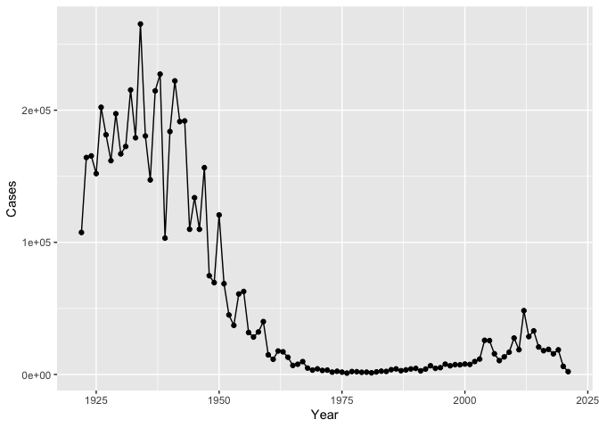
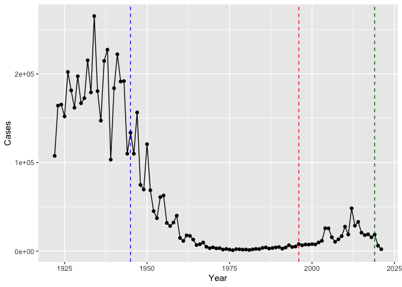
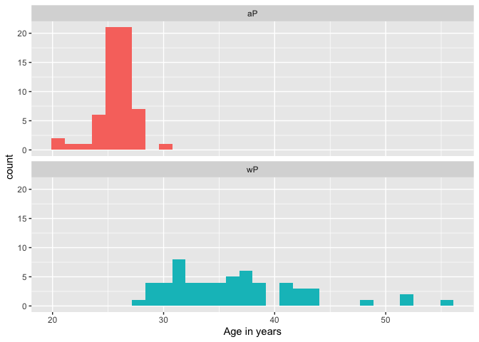
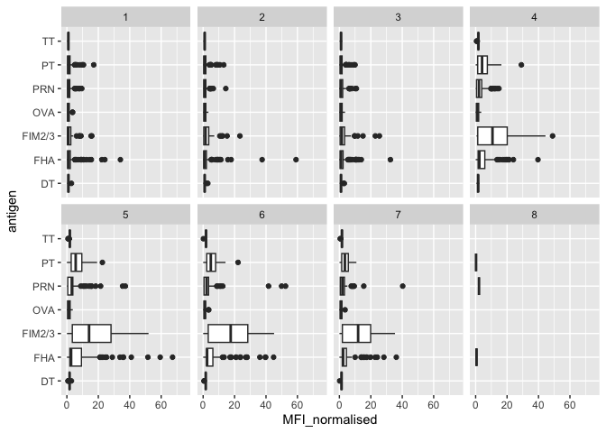
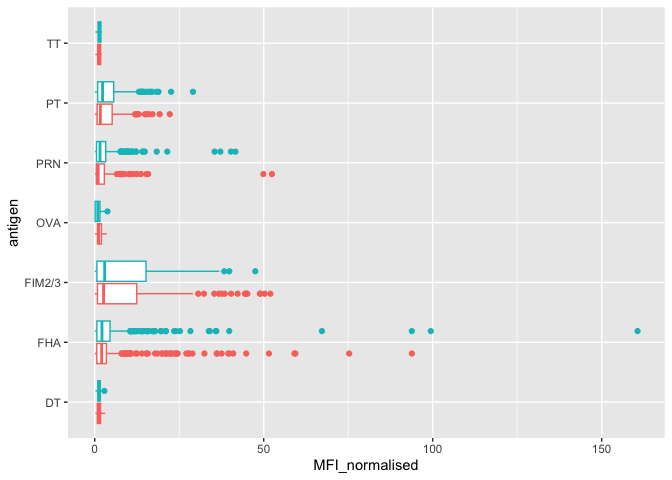
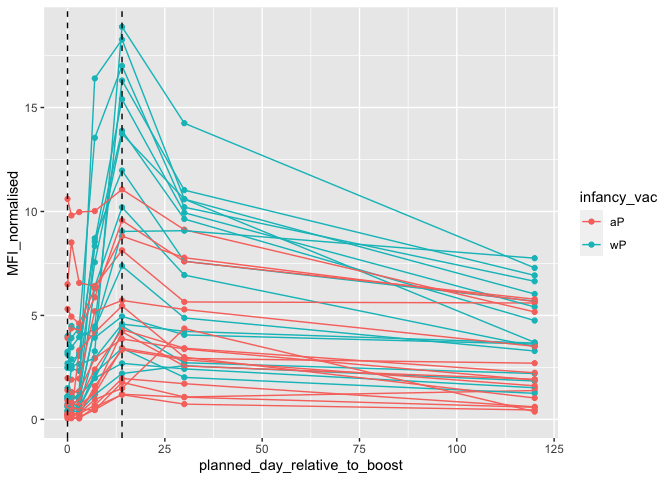
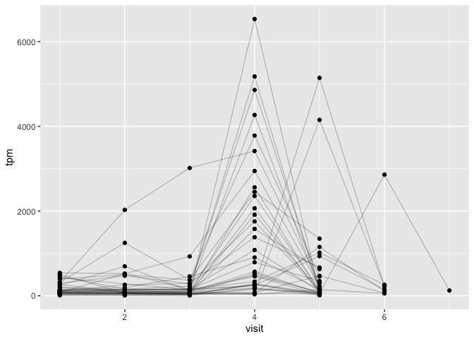

# class 19: pertussis and the CMI-PB project
chelsea

Pertussis is a severe lung infection also known a whooping cough

We wil begin by investigating the number of Pertussis cases per year in
the US

This data is availbale on the CDC website
[here](https://www.cdc.gov/pertussis/surv-reporting/cases-by-year.html)

Let’s have a look at this data.frame

``` r
head(cdc)
```

      Year  Cases
    1 1922 107473
    2 1923 164191
    3 1924 165418
    4 1925 152003
    5 1926 202210
    6 1927 181411

``` r
library(ggplot2)
ggplot(cdc) +
  aes(Year, Cases) +
  geom_point()+
  geom_line()
```



Q2. Using the ggplot geom_vline() function add lines to your previous
plot for the 1946 introduction of the wP vaccine and the 1996 switch to
aP vaccine (see example in the hint below). What do you notice?

``` r
library(ggplot2)
ggplot(cdc) +
  aes(Year, Cases) +
  geom_point()+
  geom_line()+
geom_vline(xintercept=1945, linetype="dashed", col="blue")+
geom_vline(xintercept=1996, linetype="dashed", col="red")+
geom_vline(xintercept=2019, linetype="dashed", col="dark green")
```



Q3. Describe what happened after the introduction of the aP vaccine? Do
you have a possible explanation for the observed trend? There is a lag
then cases rise with a 3 year cycle perhaps similar to that observed
before to the first wP vaccine introduction.

\#3 Why is this vaccine-preventable disease on the upswing? To answer
this question we need to investigate the mechanisms underlying waning
protection against pertussis. This requires evaluation of
pertussis-specific immune responses over time in wP and aP vaccinated
individuals. https://www.cmi-pb.org/

The CMI-PB project makes its data availble via “API-endpoint” that
return JSON format. We will use **jsonlite** package to access data.

``` r
library(jsonlite)
subject <- read_json("https://cmi-pb.org/api/subject", simplifyVector = TRUE) 
speciman <- read_json("http://cmi-pb.org/api/specimen", simplifyVector = TRUE)
titer <- read_json("http://cmi-pb.org/api/v4/plasma_ab_titer", simplifyVector = TRUE)
```

Have a wee peak at these new objects

``` r
head(subject)
```

      subject_id infancy_vac biological_sex              ethnicity  race
    1          1          wP         Female Not Hispanic or Latino White
    2          2          wP         Female Not Hispanic or Latino White
    3          3          wP         Female                Unknown White
    4          4          wP           Male Not Hispanic or Latino Asian
    5          5          wP           Male Not Hispanic or Latino Asian
    6          6          wP         Female Not Hispanic or Latino White
      year_of_birth date_of_boost      dataset
    1    1986-01-01    2016-09-12 2020_dataset
    2    1968-01-01    2019-01-28 2020_dataset
    3    1983-01-01    2016-10-10 2020_dataset
    4    1988-01-01    2016-08-29 2020_dataset
    5    1991-01-01    2016-08-29 2020_dataset
    6    1988-01-01    2016-10-10 2020_dataset

``` r
head(titer)
```

      specimen_id isotype is_antigen_specific antigen        MFI MFI_normalised
    1           1     IgE               FALSE   Total 1110.21154       2.493425
    2           1     IgE               FALSE   Total 2708.91616       2.493425
    3           1     IgG                TRUE      PT   68.56614       3.736992
    4           1     IgG                TRUE     PRN  332.12718       2.602350
    5           1     IgG                TRUE     FHA 1887.12263      34.050956
    6           1     IgE                TRUE     ACT    0.10000       1.000000
       unit lower_limit_of_detection
    1 UG/ML                 2.096133
    2 IU/ML                29.170000
    3 IU/ML                 0.530000
    4 IU/ML                 6.205949
    5 IU/ML                 4.679535
    6 IU/ML                 2.816431

Q4. How many aP and wP infancy vaccinated subjects are in the dataset?

``` r
table(subject$infancy_vac)
```


    aP wP 
    60 58 

Q5. How many Male and Female subjects/patients are in the dataset?

``` r
table(subject$biological_sex)
```


    Female   Male 
        79     39 

Q6. What is the breakdown of race and biological sex (e.g. number of
Asian females, White males etc…)?

``` r
table(subject$race, subject$biological_sex) 
```

                                               
                                                Female Male
      American Indian/Alaska Native                  0    1
      Asian                                         21   11
      Black or African American                      2    0
      More Than One Race                             9    2
      Native Hawaiian or Other Pacific Islander      1    1
      Unknown or Not Reported                       11    4
      White                                         35   20

``` r
library(tidyverse)
```

    ── Attaching core tidyverse packages ──────────────────────── tidyverse 2.0.0 ──
    ✔ dplyr     1.1.3     ✔ readr     2.1.4
    ✔ forcats   1.0.0     ✔ stringr   1.5.0
    ✔ lubridate 1.9.3     ✔ tibble    3.2.1
    ✔ purrr     1.0.2     ✔ tidyr     1.3.0
    ── Conflicts ────────────────────────────────────────── tidyverse_conflicts() ──
    ✖ dplyr::filter()  masks stats::filter()
    ✖ purrr::flatten() masks jsonlite::flatten()
    ✖ dplyr::lag()     masks stats::lag()
    ℹ Use the conflicted package (<http://conflicted.r-lib.org/>) to force all conflicts to become errors

``` r
today()
```

    [1] "2023-12-11"

``` r
mdy("05-16-2002")
```

    [1] "2002-05-16"

``` r
today()-ymd("2002-05-16")
```

    Time difference of 7879 days

``` r
time_length(today()-ymd("2002-05-16"),"years")
```

    [1] 21.57153

Q7. Using this approach determine (i) the average age of wP individuals,
(ii) the average age of aP individuals; and (iii) are they significantly
different?

``` r
subject$age <- today()-ymd(subject$year_of_birth)
subject$age_years <- time_length(subject$age, "years")
head(subject)
```

      subject_id infancy_vac biological_sex              ethnicity  race
    1          1          wP         Female Not Hispanic or Latino White
    2          2          wP         Female Not Hispanic or Latino White
    3          3          wP         Female                Unknown White
    4          4          wP           Male Not Hispanic or Latino Asian
    5          5          wP           Male Not Hispanic or Latino Asian
    6          6          wP         Female Not Hispanic or Latino White
      year_of_birth date_of_boost      dataset        age age_years
    1    1986-01-01    2016-09-12 2020_dataset 13858 days  37.94114
    2    1968-01-01    2019-01-28 2020_dataset 20433 days  55.94251
    3    1983-01-01    2016-10-10 2020_dataset 14954 days  40.94182
    4    1988-01-01    2016-08-29 2020_dataset 13128 days  35.94251
    5    1991-01-01    2016-08-29 2020_dataset 12032 days  32.94182
    6    1988-01-01    2016-10-10 2020_dataset 13128 days  35.94251

``` r
library(dplyr)

ap <- subject %>% filter(infancy_vac == "aP")

round( summary( time_length( ap$age, "years" ) ) )
```

       Min. 1st Qu.  Median    Mean 3rd Qu.    Max. 
         21      26      26      26      27      30 

``` r
wp <- subject %>% filter(infancy_vac == "wP")
round( summary( time_length( wp$age, "years" ) ) )
```

       Min. 1st Qu.  Median    Mean 3rd Qu.    Max. 
         28      31      35      36      39      56 

Q8. Determine the age of all individuals at time of boost?

``` r
int <- ymd(subject$date_of_boost) - ymd(subject$year_of_birth)
age_at_boost <- time_length(int, "year")
head(age_at_boost)
```

    [1] 30.69678 51.07461 33.77413 28.65982 25.65914 28.77481

``` r
library(ggplot2)
ggplot(subject) +
  aes(time_length(age, "year"),
      fill=as.factor(infancy_vac)) +
  geom_histogram(show.legend=FALSE) +
  facet_wrap(vars(infancy_vac), nrow=2) +
  xlab("Age in years")
```

    `stat_bin()` using `bins = 30`. Pick better value with `binwidth`.



Q9. With the help of a faceted boxplot or histogram (see below), do you
think these two groups are significantly different? These groups are
clearly different.

Q9. Complete the code to join specimen and subject tables to make a new
merged data frame containing all specimen records along with their
associated subject details:

Merge or join tables

``` r
meta <- inner_join(speciman,subject)
```

    Joining with `by = join_by(subject_id)`

``` r
head(meta)
```

      specimen_id subject_id actual_day_relative_to_boost
    1           1          1                           -3
    2           2          1                            1
    3           3          1                            3
    4           4          1                            7
    5           5          1                           11
    6           6          1                           32
      planned_day_relative_to_boost specimen_type visit infancy_vac biological_sex
    1                             0         Blood     1          wP         Female
    2                             1         Blood     2          wP         Female
    3                             3         Blood     3          wP         Female
    4                             7         Blood     4          wP         Female
    5                            14         Blood     5          wP         Female
    6                            30         Blood     6          wP         Female
                   ethnicity  race year_of_birth date_of_boost      dataset
    1 Not Hispanic or Latino White    1986-01-01    2016-09-12 2020_dataset
    2 Not Hispanic or Latino White    1986-01-01    2016-09-12 2020_dataset
    3 Not Hispanic or Latino White    1986-01-01    2016-09-12 2020_dataset
    4 Not Hispanic or Latino White    1986-01-01    2016-09-12 2020_dataset
    5 Not Hispanic or Latino White    1986-01-01    2016-09-12 2020_dataset
    6 Not Hispanic or Latino White    1986-01-01    2016-09-12 2020_dataset
             age age_years
    1 13858 days  37.94114
    2 13858 days  37.94114
    3 13858 days  37.94114
    4 13858 days  37.94114
    5 13858 days  37.94114
    6 13858 days  37.94114

Antibody measurements in the blood

``` r
head(meta)
```

      specimen_id subject_id actual_day_relative_to_boost
    1           1          1                           -3
    2           2          1                            1
    3           3          1                            3
    4           4          1                            7
    5           5          1                           11
    6           6          1                           32
      planned_day_relative_to_boost specimen_type visit infancy_vac biological_sex
    1                             0         Blood     1          wP         Female
    2                             1         Blood     2          wP         Female
    3                             3         Blood     3          wP         Female
    4                             7         Blood     4          wP         Female
    5                            14         Blood     5          wP         Female
    6                            30         Blood     6          wP         Female
                   ethnicity  race year_of_birth date_of_boost      dataset
    1 Not Hispanic or Latino White    1986-01-01    2016-09-12 2020_dataset
    2 Not Hispanic or Latino White    1986-01-01    2016-09-12 2020_dataset
    3 Not Hispanic or Latino White    1986-01-01    2016-09-12 2020_dataset
    4 Not Hispanic or Latino White    1986-01-01    2016-09-12 2020_dataset
    5 Not Hispanic or Latino White    1986-01-01    2016-09-12 2020_dataset
    6 Not Hispanic or Latino White    1986-01-01    2016-09-12 2020_dataset
             age age_years
    1 13858 days  37.94114
    2 13858 days  37.94114
    3 13858 days  37.94114
    4 13858 days  37.94114
    5 13858 days  37.94114
    6 13858 days  37.94114

``` r
dim(meta)
```

    [1] 939  15

Q10. Now using the same procedure join meta with titer data so we can
further analyze this data in terms of time of visit aP/wP, male/female
etc.

``` r
adbata <- inner_join(titer,meta)
```

    Joining with `by = join_by(specimen_id)`

``` r
head(adbata)
```

      specimen_id isotype is_antigen_specific antigen        MFI MFI_normalised
    1           1     IgE               FALSE   Total 1110.21154       2.493425
    2           1     IgE               FALSE   Total 2708.91616       2.493425
    3           1     IgG                TRUE      PT   68.56614       3.736992
    4           1     IgG                TRUE     PRN  332.12718       2.602350
    5           1     IgG                TRUE     FHA 1887.12263      34.050956
    6           1     IgE                TRUE     ACT    0.10000       1.000000
       unit lower_limit_of_detection subject_id actual_day_relative_to_boost
    1 UG/ML                 2.096133          1                           -3
    2 IU/ML                29.170000          1                           -3
    3 IU/ML                 0.530000          1                           -3
    4 IU/ML                 6.205949          1                           -3
    5 IU/ML                 4.679535          1                           -3
    6 IU/ML                 2.816431          1                           -3
      planned_day_relative_to_boost specimen_type visit infancy_vac biological_sex
    1                             0         Blood     1          wP         Female
    2                             0         Blood     1          wP         Female
    3                             0         Blood     1          wP         Female
    4                             0         Blood     1          wP         Female
    5                             0         Blood     1          wP         Female
    6                             0         Blood     1          wP         Female
                   ethnicity  race year_of_birth date_of_boost      dataset
    1 Not Hispanic or Latino White    1986-01-01    2016-09-12 2020_dataset
    2 Not Hispanic or Latino White    1986-01-01    2016-09-12 2020_dataset
    3 Not Hispanic or Latino White    1986-01-01    2016-09-12 2020_dataset
    4 Not Hispanic or Latino White    1986-01-01    2016-09-12 2020_dataset
    5 Not Hispanic or Latino White    1986-01-01    2016-09-12 2020_dataset
    6 Not Hispanic or Latino White    1986-01-01    2016-09-12 2020_dataset
             age age_years
    1 13858 days  37.94114
    2 13858 days  37.94114
    3 13858 days  37.94114
    4 13858 days  37.94114
    5 13858 days  37.94114
    6 13858 days  37.94114

``` r
dim(adbata)
```

    [1] 41810    22

Q11. How many specimens (i.e. entries in abdata) do we have for each
isotype?

``` r
table(adbata$isotype)
```


     IgE  IgG IgG1 IgG2 IgG3 IgG4 
    6698 3240 7968 7968 7968 7968 

Q12. What are the different \$dataset values in abdata and what do you
notice about the number of rows for the most “recent” dataset?

``` r
table(adbata$dataset)
```


    2020_dataset 2021_dataset 2022_dataset 
           31520         8085         2205 

Let’s focus on IgG Boxplot of MFI_normalised vs antigen

``` r
igg <- adbata %>% filter(isotype == "IgG")
head(igg)
```

      specimen_id isotype is_antigen_specific antigen        MFI MFI_normalised
    1           1     IgG                TRUE      PT   68.56614       3.736992
    2           1     IgG                TRUE     PRN  332.12718       2.602350
    3           1     IgG                TRUE     FHA 1887.12263      34.050956
    4          19     IgG                TRUE      PT   20.11607       1.096366
    5          19     IgG                TRUE     PRN  976.67419       7.652635
    6          19     IgG                TRUE     FHA   60.76626       1.096457
       unit lower_limit_of_detection subject_id actual_day_relative_to_boost
    1 IU/ML                 0.530000          1                           -3
    2 IU/ML                 6.205949          1                           -3
    3 IU/ML                 4.679535          1                           -3
    4 IU/ML                 0.530000          3                           -3
    5 IU/ML                 6.205949          3                           -3
    6 IU/ML                 4.679535          3                           -3
      planned_day_relative_to_boost specimen_type visit infancy_vac biological_sex
    1                             0         Blood     1          wP         Female
    2                             0         Blood     1          wP         Female
    3                             0         Blood     1          wP         Female
    4                             0         Blood     1          wP         Female
    5                             0         Blood     1          wP         Female
    6                             0         Blood     1          wP         Female
                   ethnicity  race year_of_birth date_of_boost      dataset
    1 Not Hispanic or Latino White    1986-01-01    2016-09-12 2020_dataset
    2 Not Hispanic or Latino White    1986-01-01    2016-09-12 2020_dataset
    3 Not Hispanic or Latino White    1986-01-01    2016-09-12 2020_dataset
    4                Unknown White    1983-01-01    2016-10-10 2020_dataset
    5                Unknown White    1983-01-01    2016-10-10 2020_dataset
    6                Unknown White    1983-01-01    2016-10-10 2020_dataset
             age age_years
    1 13858 days  37.94114
    2 13858 days  37.94114
    3 13858 days  37.94114
    4 14954 days  40.94182
    5 14954 days  40.94182
    6 14954 days  40.94182

Q13. Complete the following code to make a summary boxplot of Ab titer
levels (MFI) for all antigens:

``` r
ggplot(igg) +
  aes(MFI_normalised, antigen) +
  geom_boxplot()+
   xlim(0,75) +
  facet_wrap(vars(visit), nrow=2)
```

    Warning: Removed 5 rows containing non-finite values (`stat_boxplot()`).



``` r
ggplot(igg) +
  aes(MFI_normalised, antigen, col=infancy_vac ) +
  geom_boxplot(show.legend = FALSE) 
```



``` r
igg.pt <- igg %>%filter(antigen=="PT", dataset=="2021_dataset")
```

focus on IgG to the Pertussis Toxin(PT) antigen in the 2021 dataset

``` r
ggplot(igg.pt) +
  aes(planned_day_relative_to_boost, MFI_normalised, col=infancy_vac, group=subject_id) +
  geom_point()+geom_line()+
  geom_vline(xintercept=0, linetype="dashed", col="black")+
  geom_vline(xintercept=14, linetype="dashed", col="black")
```



wp is higher than ap

``` r
url <- "https://www.cmi-pb.org/api/v2/rnaseq?versioned_ensembl_gene_id=eq.ENSG00000211896.7"

rna <- read_json(url, simplifyVector = TRUE) 

#meta <- inner_join(specimen, subject)
ssrna <- inner_join(rna, meta)
```

    Joining with `by = join_by(specimen_id)`

``` r
ggplot(ssrna) +
  aes(visit, tpm, group=subject_id) +
  geom_point() +
  geom_line(alpha=0.2)
```



What do you notice about the expression of this gene (i.e. when is it at
it’s maximum level)? TPM expression values is maximum when at visit
times 4.
